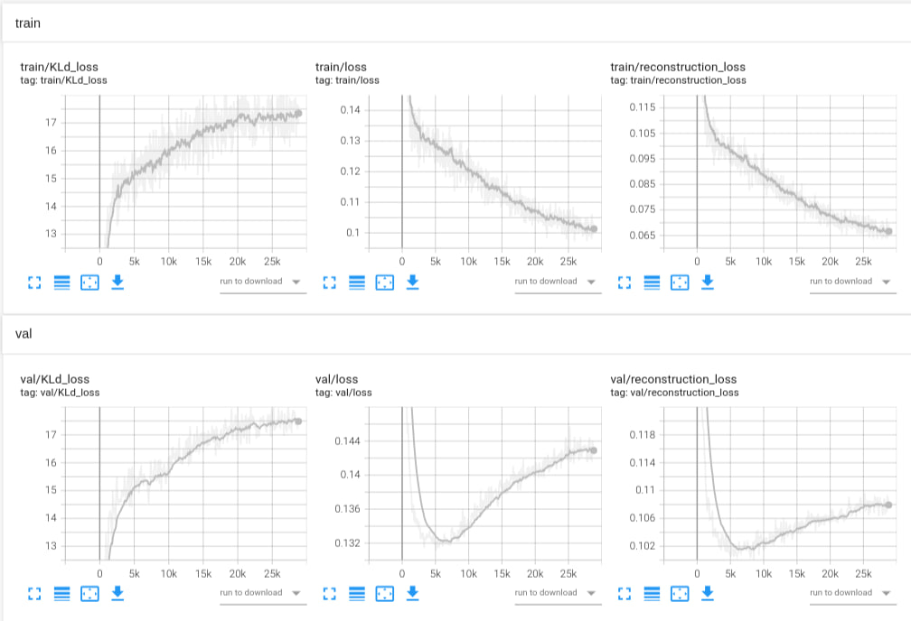
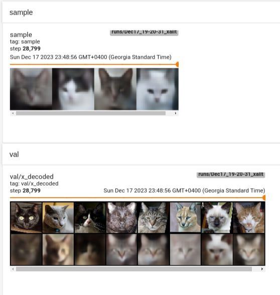
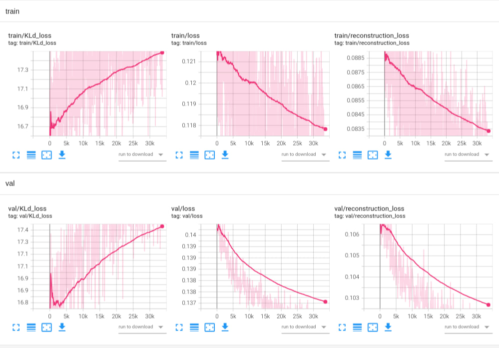
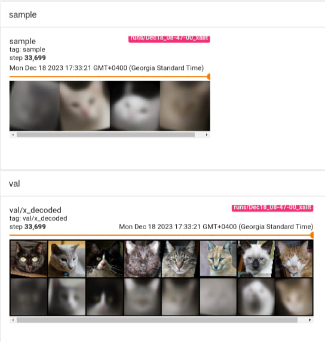

# Introduction

## First experiments with DDPM

I first tried out training DDPM by using the code from the small Diffusion homework

After 1-2 days realized it would take a long time to train well and debug &mdash; a decreasing loss during training doesn't improve the samples. The errors accumulate too much over the 1000 steps.

it would be easier to debug&train than something like a VAE / GAN so I started off with a VAE

## VAE vs GAN

VAEs are:
- more straightforward to train (a single loss over every training step)
- but generate "average" samples because of the MSE training (regression to the mean)

GANs are:
- harder to train: balancing act between generator/discriminator that involves some hyperparameter tuning
- generate better, sharper samples because of the adversarial training

Started experimenting with VAEs, and, as expected, got blurry results. Sadly, I didn't have enough time to try out a GAN, which would have definitely worked better.

# Overview

Chose the **Cats** dataset for this exercise: https://disk.yandex.ru/d/FXwuU1uWTLwOmQ

Design choices:
- image size 64 &mdash; out of 32/64/128/256, 64 seemed like a good compromise between speed and quality (the images in the original dataset are 256)
- weight 0.02 on the $\mathcal{L}_{KL}$ &mdash; otherwise it would overpower the reconstruction loss, and all the samples would look like a single average cat
- latent_dim=256 &mdash; the smaller the latent_dim was, the more "average" the results were
- weight_decay=$10^{-4}$ &mdash; early attempts often collapsed quickly and stopped improving the loss altogether. With weight_decay the optimization process didn't halt and slowly went on. As if the L2 term helps our parameters escape a week local minimum
- model architecture: ResNets of Conv layers &mdash; mostly motivated by the VAE architecture from Stable Diffusion. But no attention layers &mdash; as far as I know, they are powerful, but are slow to train

# Results
## Overfit run
This is the second-to-last run I did, for 4.5 hours. As you can see, it clearly overfits to the training set

Which results in these samples:

The generated samples are actually a lot better than in the latter run, but because we know the model overfit to the training set, it is most likely just samples very close the training samples.

And the reconstruction loses crucial details

Metrics on Test:
SSIM: 0.00342
FID: 126.868

## Latest run
The last run. It ran for 9 hours, and trains slowly, but it doesn't overfit

Two additions on top of the design choices from the overview:
- dropout=0 &mdash; having dropout=0.1 didn't help, augmentation was a better overfitting prevention method
- augmentation: random crop, random horizontal flip, random rotation
- latent_dim=512
- Larger model in general (+1 Down/Up sampling layer on both the encoder and decoder)

It's clear that it's not overfitting (whereas the previous run started overfitting after ~1 hour)

These are the image samples:

We can see how rotations with black padding occur in the samples, because of the augmentation.

Metrics on Test:
SSIM: 0.00448
FID: 243.27

What's interesting is that this FID is bigger than from the overfit run.